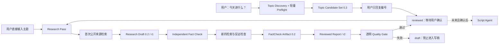

# DeepTalk Studio 架构

## 设计目标

系统把需要判断力的 AI 工作与必须稳定的工程契约分开。Agent 负责搜索、比较和分析；Python 核心负责校验、保存和为下游提供一致工件。这样未来更换模型、搜索工具或视频工具时，不需要重写整个项目。

## V0.3 数据流

## 模块职责

| 模块 | 只负责什么 | 不负责什么 |
|---|---|---|
| `.agents/skills/discover-topics` | 近期候选、Source Seed 预检、自然语言筛选和编号选择 | 最终事实裁决、口播稿、模仿创作者 |
| `.agents/skills/research-topic` | 搜索策略、来源判断、观点比较和报告组装 | 成品口播稿、发布 |
| `models.py` | 接收和复制版本化 Research / Candidate 对象 | 判断事实真假 |
| `schema.py` | 正式工件契约和 API/Codex 内容草稿契约 | 业务校验和渲染 |
| `discovery_derivation.py` | 纯确定性 Seed provenance、Preflight、评分、排序、首选、统计推导 | 打开网页或确认事实 |
| `discovery.py` | 组装 Candidate Set、Channel Profile、Research Handoff | 完整 Fact Check 或热度造假 |
| `discovery_validation.py` | Candidate Set / Handoff 契约、时间、Seed URL 与所有机器字段的重新推导校验 | 从网页推断事实 |
| `discovery_renderer.py` | 最多五张普通人可读选题卡 | 解析 Markdown 作为机器接口 |
| `discovery_storage.py` | 不可覆盖的选题历史和 latest 指针 | 云端选题库 |
| `validation.py` | 完整 Schema、ID、URL、分类、指标和交叉引用完整性 | 自动证明现实世界事实 |
| `renderer.py` | 把通过校验的报告转成中文 Markdown | 修改研究结论 |
| `storage.py` | 不可覆盖的修订路径、Markdown/JSON 和 FactCheck 保存 | 云端存储 |
| `sources.py` | URL 规范化、重复、同发布者与疑似转载的确定性分组 | 把未知来源猜成独立来源 |
| `provenance.py` | 提取 API 搜索调用、完整来源和 URL citation 并匹配报告来源 | 信任模型自报 URL |
| `fact_check.py` | 高风险队列、新旧来源统一归组、独立 Artifact 校验和核查结果应用 | 在原 Research Pass 内自我确认 |
| `quality.py` | 从证据账本计算透明指标和 Gate | 用神秘总分代替底层指标 |
| `revisions.py` | 新修订、更正历史和审批状态重置 | 静默覆盖旧报告 |
| `migration.py` | 确定性迁移 0.1，并保持未核查状态 | 伪造旧报告已完成 Fact Check |
| `providers/openai.py` | 两次 Responses API 调用、结构化输出与 tool provenance | 绑定其他模块到 OpenAI SDK |
| `workflow.py` | 串联 draft → independent review → quality gate → revisions | 搜索细节 |
| `cli.py` | 给自动化和调试提供稳定入口 | 图形界面 |

## 稳定工件

Research Report JSON 和 FactCheck Artifact JSON 是 V0.2 的正式接口。Markdown 是给人阅读的派生物，不应被未来 Agent 反向解析。两类工件都带版本；破坏兼容性的修改必须提升版本并提供迁移策略。

Research Report 0.2 由四个核心账本组成：

- `sources`：来源身份、URL、检查方式、provenance 与独立性分组；
- `claims`：分类、置信度、重要性、风险和核查状态；
- `evidence_links`：来源对主张的支持、反驳、归属或背景关系；
- `quality_summary`：由前三者和 Fact Check 状态自底向上计算的指标。

V0.2.1 新增两个内部边界，但不改变正式工件版本：

- `API_RESEARCH_DRAFT_JSON_SCHEMA` 只接收模型的研究判断，不接收身份、revision、时间、状态、provenance、质量或审批字段；
- Fact Check 新来源先与 r1 来源合并执行确定性分组，再保存 Artifact 和生成 r2。

`confirmed_fact` 的独立确认必须同时满足 `supports`、provenance 已匹配、来源明确为 `independent`、且 group 不同。group ID 不同本身不是独立性证明。

V0.3 新增上游 `Topic Candidate Set 0.3`，不改变 Research Report 0.2：

- Channel Profile 是版本化的编辑定位，当前为 `config/channel-profile.json`；
- Candidate Set 记录候选、why now、核心张力、研究问题、风险、时效、Source Seeds、五项评分理由和代码计算的总分；
- Source Seed 只是后续检索入口，不能当作已确认事实或 Evidence Link；
- Codex 检查页面的真实 URL 由后台 inspection manifest 单独记录；Raw Candidate 不能声称 `manual_open`，未记录的 Seed 为 `unmatched`；
- Preflight 只将已匹配的合格来源类型计作研究方向，并在 URL、publisher、host 层面保守去重；
- Candidate Set 读取时从内容、provenance、时间与固定规则重新推导所有资格、评分、展示、首选和统计机器字段；
- Preflight 先排除匿名传言、无公开资料、纯情绪、模仿型题材、高风险弱证据、时间倒置/明显未来时间和不足 7 项 Raw 池；`watch` 不进入 Top 5；
- 展示先保证类别多样性，再以排序补足空位；相同事件仍永不重复；
- `display_candidate_ids` 是唯一给用户展示和按编号选择的机器接口；Markdown 仅供阅读；
- Research Handoff Brief 从 Candidate JSON 生成，模式 B 在这里汇入原有 Research Workflow，模式 A 不经过 Discovery。

未来模块的建议输入输出：

| 模块 | 输入 | 输出 |
|---|---|---|
| Topic Discovery | 频道策略、时间窗口、公开页面 | Topic Candidate Set 0.3 |
| Research | Topic Candidate 或用户主题 | Research Report JSON |
| Fact Check | Research Draft | FactCheck Artifact + 新修订 Research Report |
| Perspective Analysis | Research Report | Perspective Map JSON |
| Script Writing | 已 Review 的 Research Report | Script Draft JSON / Markdown |
| Material Search | Script Draft + Research Report | Material Manifest JSON |
| Visual Generation | Material Manifest | Visual Assets + provenance |
| Editing Plan | Script + Material Manifest | Timeline / Shot Plan JSON |
| Publishing | 审批后的成品和元数据 | Platform Publish Record |

## 安全边界

- 真实报告默认不进入 Git，避免把未经审查的指控或个人信息意外公开。
- 网络内容始终是不可信输入；报告只能存文本与 URL，不执行网页代码。
- API 密钥只从环境变量读取，HTTP payload、异常和报告都不包含密钥。
- API 模式保留 `web_search_call.action.sources` 和 URL citation；无法匹配真实工具结果的来源会被降级。
- API Structured Output 只生成 research content；任何模型自报的质量或审批字段都会在草稿契约处被拒绝。
- Discovery API 只生成 Raw Candidate 内容；Candidate ID、总分、资格、推荐、首选、时间与 provenance 由代码拥有。Seed 无法匹配 API Web Search 结果时不能装作已打开。
- Creator metadata 只可作为可选 attention signal，绝不是事实证据；不绕过登录或限制，也不保存创作者脚本、字幕或独特表达。
- Codex 模式记录 `codex_tool_result` 与实际打开 URL，不能把搜索摘要假装成已检查正文。
- 每个修订路径包含 `report_id` 和 `rNNNN`，已存在文件拒绝覆盖。
- 发布前必须有人类编辑 Review；工程校验不等于新闻事实认证。

## 扩展原则

新增 Agent 时先定义工件和验收，再实现最小工作流。只有确有多个调用方时才抽象共享框架。不要为了“多 Agent”外观把一个清晰步骤拆成无意义的多个 Prompt。
