# DeepTalk Studio 架构

## 设计目标

系统把需要判断力的 AI 工作与必须稳定的工程契约分开。Agent 负责搜索、比较和分析；Python 核心负责校验、保存和为下游提供一致工件。这样未来更换模型、搜索工具或视频工具时，不需要重写整个项目。

## V0.5 数据流

```mermaid
flowchart LR
    U["用户直接输入主题"] --> R["Research Pass"]
    B["用户：今天讲什么？"] --> TD["Topic Discovery + 轻量 Preflight"]
    TD --> TC["Topic Candidate Set 0.3"]
    TC --> C["用户只回复编号"]
    C --> RH["Research Handoff Brief 0.3"]
    RH --> R
    R --> W1["首次公开来源检索"]
    W1 --> D1["Research Draft 0.2 / r1"]
    D1 --> F["Independent Fact Check"]
    F --> W2["新的检索与反证检查"]
    W2 --> A["FactCheck Artifact 0.2"]
    A --> D2["Reviewed Report / r2"]
    D2 --> Q["透明 Quality Gate"]
    Q -->|失败| X["draft：禁止进入写稿"]
    Q -->|通过| P["reviewed：等待用户确认"]
    P --> AR["Approval Revision：ready_for_script"]
    AR --> SW["Original Script Writer"]
    SW --> SD1["Script Draft 0.4 / r1"]
    SD1 --> SR["Independent Script Review"]
    SR -->|有阻断问题| SDF["Script r2：draft"]
    SR -->|通过且 check/issue 一致| SD2["Script r2：reviewed + Review linkage"]
    SD2 --> E["Editor Markdown"]
    SD2 --> T["Teleprompter Markdown"]
    SD2 --> MG["Material input Gate：复验 Review + exact Research"]
    MG --> MS["Material Search + actual page inspection"]
    MS --> PA["Input + Inspection + Rights provenance artifacts"]
    PA --> MP1["Material Package 0.5.1 / r1"]
    MP1 --> VG["Research-grounded Visual Spec + SVG"]
    VG --> MR["Independent Material Review"]
    MR -->|危险项可隔离| MPW["r2 reviewed_with_warnings"]
    MR -->|安全通过| MP2["r2 reviewed"]
    MP1 -.重建并复验.-> MP2
    MR -->|包级问题/无安全方案| MPB["r2 blocked"]
    MS -->|发现冲突或更新| RU["research_update_required：返回 Research"]
```

## 模块职责

| 模块 | 只负责什么 | 不负责什么 |
|---|---|---|
| `.agents/skills/discover-topics` | 近期候选、Source Seed 预检、自然语言筛选和编号选择 | 最终事实裁决、口播稿、模仿创作者 |
| `.agents/skills/research-topic` | 搜索策略、来源判断、观点比较和报告组装 | 成品口播稿、发布 |
| `models.py` | 接收和复制版本化 Research / Candidate 对象 | 判断事实真假 |
| `schema.py` | 正式工件契约和 API/Codex 内容草稿契约 | 业务校验和渲染 |
| `discovery_derivation.py` | 纯确定性 Seed provenance、Preflight、评分、排序、首选、统计推导 | 打开网页或确认事实 |
| `discovery.py` | 组装 Candidate Set、Channel Profile、Research Handoff | 完整 Fact Check 或热度造假 |
| `discovery_validation.py` | Candidate Set / Handoff 契约、时间、Seed URL 与所有机器字段的重新推导校验 | 从网页推断事实 |
| `discovery_renderer.py` | 最多五张普通人可读选题卡 | 解析 Markdown 作为机器接口 |
| `discovery_storage.py` | 不可覆盖的选题历史和 latest 指针 | 云端选题库 |
| `validation.py` | 完整 Schema、ID、URL、分类、指标和交叉引用完整性 | 自动证明现实世界事实 |
| `renderer.py` | 把通过校验的报告转成中文 Markdown | 修改研究结论 |
| `storage.py` | 不可覆盖的修订路径、Markdown/JSON 和 FactCheck 保存 | 云端存储 |
| `sources.py` | URL 规范化、重复、同发布者与疑似转载的确定性分组 | 把未知来源猜成独立来源 |
| `provenance.py` | 提取 API 搜索调用、完整来源和 URL citation 并匹配报告来源 | 信任模型自报 URL |
| `fact_check.py` | 高风险队列、新旧来源统一归组、独立 Artifact 校验和核查结果应用 | 在原 Research Pass 内自我确认 |
| `quality.py` | 从证据账本计算透明指标和 Gate | 用神秘总分代替底层指标 |
| `revisions.py` | 新修订、更正、Approval Revision 和审批状态重置 | 静默覆盖旧报告 |
| `.agents/skills/write-script` | 用户确认、原创写稿、独立审稿、自然语言修改与比较 | 自行联网研究、素材、发布 |
| `script_profile.py` | 加载口播风格、时长和原创性约束 | 生成稿件内容 |
| `script_validation.py` | Approval Gate、Grounding、Fact / Attribution / Analysis、Review linkage、Beat identity 和机器字段校验 | 判断现实事实或润色稿件 |
| `script_review.py` | 规范化独立审稿问题、15 项必检、check/issue 一致性和阻断 Gate | 扮演 Writer 或自动发布 |
| `script_renderer.py` | 派生 Editor / Teleprompter Markdown | 修改 Script Artifact |
| `script_storage.py` | 不可覆盖稿件、Review Artifact 和 latest 指针 | 云端内容库 |
| `script_revisions.py` | 新稿件 revision 与版本比较 | 偷换 Research revision |
| `script_workflow.py` | 串联 approved report → Writer → Reviewer → outputs | Web Search 或 Fact Check |
| `.agents/skills/prepare-materials` | 自然语言素材搜索、实际打开、权利依据、原创 Visual 和独立 Review | 完整视频、剪辑或发布 |
| `material_schema.py` | Material Content / Package / Visual / Review 完整 JSON 契约 | 打开网页或判断现实版权 |
| `material_profile.py` | B 站 1920×1080、视觉边界、MIME 和大小限制 | 生成候选内容 |
| `material_validation.py` | 输入 Gate、Cue、Claim/Evidence、actual-open rights、ranking、nested Visual grounding、r1 provenance 重建 | 搜索或下载 |
| `material_acquisition.py` | 公开 URL、安全静态下载、capture 登记、size/SHA-256 | 绕过限制或下载未知权利素材 |
| `visual_renderer.py` | timeline/bar/comparison/diagram 的确定性 1920×1080 SVG | 完整动画视频 |
| `material_review.py` | 10 项独立复核、typed issues、item isolation、package Gate | 扩大 Research |
| `material_renderer.py` | 普通用户简明素材准备单 | 机器状态解析 |
| `material_storage.py` | 不可覆盖 Package / Review / provenance artifacts，并在加载 r2 时 canonical revalidation | 云端资产库 |
| `material_workflow.py` | 串联 Search → provenance → SVG → Review → revisions | 剪辑、字幕或发布 |
| `migration.py` | 确定性迁移 0.1，并保持未核查状态 | 伪造旧报告已完成 Fact Check |
| `providers/openai.py` | 两次 Responses API 调用、结构化输出与 tool provenance | 绑定其他模块到 OpenAI SDK |
| `workflow.py` | 串联 draft → independent review → quality gate → revisions | 搜索细节 |
| `cli.py` | 给自动化和调试提供稳定入口 | 图形界面 |

## 稳定工件

Research Report JSON 和 FactCheck Artifact JSON 是 V0.2 的正式接口。Markdown 是给人阅读的派生物，不应被未来 Agent 反向解析。两类工件都带版本；破坏兼容性的修改必须提升版本并提供迁移策略。

Research Report 0.2 由四个核心账本组成：

- `sources`：来源身份、URL、检查方式、provenance 与独立性分组；
- `claims`：分类、置信度、重要性、风险和核查状态；
- `evidence_links`：来源对主张的支持、反驳、归属或背景关系；
- `quality_summary`：由前三者和 Fact Check 状态自底向上计算的指标。

V0.2.1 新增两个内部边界，但不改变正式工件版本：

- `API_RESEARCH_DRAFT_JSON_SCHEMA` 只接收模型的研究判断，不接收身份、revision、时间、状态、provenance、质量或审批字段；
- Fact Check 新来源先与 r1 来源合并执行确定性分组，再保存 Artifact 和生成 r2。

`confirmed_fact` 的独立确认必须同时满足 `supports`、provenance 已匹配、来源明确为 `independent`、且 group 不同。group ID 不同本身不是独立性证明。

V0.3 新增上游 `Topic Candidate Set 0.3`，不改变 Research Report 0.2：

- Channel Profile 是版本化的编辑定位，当前为 `config/channel-profile.json`；
- Candidate Set 记录候选、why now、核心张力、研究问题、风险、时效、Source Seeds、五项评分理由和代码计算的总分；
- Source Seed 只是后续检索入口，不能当作已确认事实或 Evidence Link；
- Codex 检查页面的真实 URL 由后台 inspection manifest 单独记录；Raw Candidate 不能声称 `manual_open`，未记录的 Seed 为 `unmatched`；
- Preflight 只将已匹配的合格来源类型计作研究方向，并在 URL、publisher、host 层面保守去重；
- Candidate Set 读取时从内容、provenance、时间与固定规则重新推导所有资格、评分、展示、首选和统计机器字段；
- Preflight 先排除匿名传言、无公开资料、纯情绪、模仿型题材、高风险弱证据、时间倒置/明显未来时间和不足 7 项 Raw 池；`watch` 不进入 Top 5；
- 展示先保证类别多样性，再以排序补足空位；相同事件仍永不重复；
- `display_candidate_ids` 是唯一给用户展示和按编号选择的机器接口；Markdown 仅供阅读；
- Research Handoff Brief 从 Candidate JSON 生成，模式 B 在这里汇入原有 Research Workflow，模式 A 不经过 Discovery。

V0.4 新增下游 `Script Draft Artifact 0.4` 与 `Script Review Artifact 0.4`，不改变 Research Report 0.2：

- Approval 不覆盖 reviewed report，而是创建新 revision，精确保存用户原始确认；任何新研究内容修订都会重置 Approval；
- Script Draft 精确绑定 `report_id + report_revision + script_profile_version`；Writer 只能生成内容字段，身份、状态、revision、Beat ID、字数、时长和 must-keep coverage 均由代码拥有；
- 每个 Beat 通过 `content_kind`、`claim_ids`、`evidence_link_ids` 和 `analysis_basis_claim_ids` 保留事实、归因与分析边界；
- Script Review 与 Writer 分离，要求 15 个唯一必检项；issue severity、blocking count 和 gate status 从 issue type 确定性推导；
- V0.4.1 将每个 failed check 映射到允许的 issue type；八项事实安全 check 必须拥有匹配的 blocking issue，其他失败也不得没有 issue。无效输出直接拒绝，`not_applicable` 不能跳过事实安全 check；
- Review 通过或失败都会创建新的 Script revision：通过为 `reviewed`，失败仍为 `draft`；通过版保存 review ID、来源 revision、passing Gate 与内容 SHA-256，并在读取时复验对应 Artifact；
- Beat identity 由代码维护：保留段落维持 ID，新增段落取得单调递增 ID，删除 ID 进入退休集合且不复用；比较据此报告真实变化；
- Editor Markdown 包含机器回链和风险提示，Teleprompter Markdown 只含朗读正文；Markdown 都是 JSON 的派生物；
- Writer 和 Reviewer 都不能启用 Web Search；API 返回任何搜索 provenance 都会失败关闭。

V0.5.1 的 `Material Package Artifact` 与 `Material Review Artifact` 不改变 Research 或 Script Artifact：

- Material input Gate 重新验证 reviewed Script 的 V0.4.1 Review linkage、内容 digest 和 exact Research revision；
- Cue anchor 是 Beat 中的短原句，不使用伪音频 timecode；
- API Search provenance 只能把 URL 标为 `discovered`，actual-open inspection manifest 才能标为 `inspected`；
- Rights manifest 与 inspection 分离；safe reuse 必须有素材页和 rights evidence 页的 actual-open record，最终 eligibility 由 code-owned Gate 失败关闭；
- 新事实触发 `research_update_required`，不进入现有 Script 或 Visual；
- Visual Spec 的顶层和每个子项都只引用 approved timeline/Claim/Evidence，并生成真实静态 SVG；
- r1 保存 input/inspection/rights provenance artifacts；r2 只能由精确 r1 + Independent Review 重新导出。独立 Review 可隔离危险 item；包级伪造、无安全替代或 Research update 会失败关闭；
- Remotion / HyperFrames 仅使用 deterministic dimensions/duration/target hints 作为未来接口，不是 V0.5 runtime。

V0.6 新增 `Production Plan 0.6 → Renderer Adapter → Motion Asset Manifest → Production QA`：

- Production input 先调用 V0.5.1 canonical loader，不直接信任 reviewed 字段。
- Production Plan 是两个 renderer 之上的唯一语义接口；Remotion 和 HyperFrames 只把同一 Scene 契约转成各自工程，不是两个独立制作系统。
- `renderer_mode=auto` 根据已审 Visual hint 和 Profile 确定选择；普通流程只实例化 `selected_renderer`。
- Adapter stage asset 时重新检查 root/path/MIME/size/SHA/eligibility，只复制已在 Scene 中合法引用的本地素材。
- Remotion 使用 frame-driven React Composition；HyperFrames 使用 DESIGN-first HTML 与 paused GSAP timeline。两者都产生 clips、rough preview 和 hero still。
- Manifest 只接收真实存在且经 ffprobe 和 SHA 复核的文件。QA 的 clip/package Gate 由程序推导，模型不能自报 pass。

未来模块的建议输入输出：

| 模块 | 输入 | 输出 |
|---|---|---|
| Topic Discovery | 频道策略、时间窗口、公开页面 | Topic Candidate Set 0.3 |
| Research | Topic Candidate 或用户主题 | Research Report JSON |
| Fact Check | Research Draft | FactCheck Artifact + 新修订 Research Report |
| Perspective Analysis | Research Report | Perspective Map JSON |
| Script Writing | 已批准的 `ready_for_script` Research Revision | Script Draft 0.4 + Script Review 0.4 + Editor / Teleprompter |
| Material Search | reviewed Script + exact Research + Review Artifact | Material Package 0.5.1 |
| Visual Generation | grounded Visual Spec | SVG Assets + hash + target hints |
| Motion Production | reviewed Material Package + Script + Research | Production Plan 0.6 + MP4/PNG + Manifest + QA |
| Editing Plan | Script + Motion Asset Manifest | Final Timeline / Shot Plan JSON |
| Publishing | 审批后的成品和元数据 | Platform Publish Record |

## 安全边界

- 真实报告默认不进入 Git，避免把未经审查的指控或个人信息意外公开。
- 网络内容始终是不可信输入；报告只能存文本与 URL，不执行网页代码。
- API 密钥只从环境变量读取，HTTP payload、异常和报告都不包含密钥。
- API 模式保留 `web_search_call.action.sources` 和 URL citation；无法匹配真实工具结果的来源会被降级。
- API Structured Output 只生成 research content；任何模型自报的质量或审批字段都会在草稿契约处被拒绝。
- Discovery API 只生成 Raw Candidate 内容；Candidate ID、总分、资格、推荐、首选、时间与 provenance 由代码拥有。Seed 无法匹配 API Web Search 结果时不能装作已打开。
- Creator metadata 只可作为可选 attention signal，绝不是事实证据；不绕过登录或限制，也不保存创作者脚本、字幕或独特表达。
- Codex 模式记录 `codex_tool_result` 与实际打开 URL，不能把搜索摘要假装成已检查正文。
- 每个修订路径包含 `report_id` 和 `rNNNN`，已存在文件拒绝覆盖。
- Script 路径同时包含 `report_id`、`script_id` 和 `rNNNN`，并拒绝覆盖；Review Artifact 单独保存。
- Script Writer / Reviewer 不具备搜索工具；它们不能把外部知识或研究空白悄悄写进稿件。
- `avoid_claims` 的直接匹配由程序硬阻止；语义近似、长引用和原创表达风险由独立 Reviewer 检查。
- Material 搜索摘要不能冒充 actual page inspection；Rights 不能从来源名称推断。
- 未知版权新闻/视频/creator 内容不自动下载；所有本地 asset 记录大小和 SHA-256，并拒绝覆盖。
- 生成画面不能冒充新闻、文件、UI、真人或真实事件现场，也不能使用 Research 外数据。
- Production 每次 stage 前重新检查素材路径边界、MIME、size、SHA 和 eligibility；任何 non-ready 素材不得进入 Composition。
- 发布前必须有人类编辑 Review；工程校验不等于新闻事实认证。

## 扩展原则

新增 Agent 时先定义工件和验收，再实现最小工作流。只有确有多个调用方时才抽象共享框架。不要为了“多 Agent”外观把一个清晰步骤拆成无意义的多个 Prompt。
