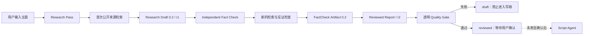

# DeepTalk Studio 架构

## 设计目标

系统把需要判断力的 AI 工作与必须稳定的工程契约分开。Agent 负责搜索、比较和分析；Python 核心负责校验、保存和为下游提供一致工件。这样未来更换模型、搜索工具或视频工具时，不需要重写整个项目。

## V0.2 数据流

## 模块职责

| 模块 | 只负责什么 | 不负责什么 |
|---|---|---|
| `.agents/skills/research-topic` | 搜索策略、来源判断、观点比较和报告组装 | 成品口播稿、发布 |
| `models.py` | 接收和复制版本化报告对象 | 判断事实真假 |
| `schema.py` | 机器输出的字段和枚举契约 | 业务校验和渲染 |
| `validation.py` | 完整 Schema、ID、URL、分类、指标和交叉引用完整性 | 自动证明现实世界事实 |
| `renderer.py` | 把通过校验的报告转成中文 Markdown | 修改研究结论 |
| `storage.py` | 不可覆盖的修订路径、Markdown/JSON 和 FactCheck 保存 | 云端存储 |
| `sources.py` | URL 规范化、重复、同发布者与疑似转载分组 | 判断报道内容真假 |
| `provenance.py` | 提取 API 搜索调用、完整来源和 URL citation 并匹配报告来源 | 信任模型自报 URL |
| `fact_check.py` | 高风险队列、独立 Artifact 校验和核查结果应用 | 在原 Research Pass 内自我确认 |
| `quality.py` | 从证据账本计算透明指标和 Gate | 用神秘总分代替底层指标 |
| `revisions.py` | 新修订、更正历史和审批状态重置 | 静默覆盖旧报告 |
| `migration.py` | 确定性迁移 0.1，并保持未核查状态 | 伪造旧报告已完成 Fact Check |
| `providers/openai.py` | 两次 Responses API 调用、结构化输出与 tool provenance | 绑定其他模块到 OpenAI SDK |
| `workflow.py` | 串联 draft → independent review → quality gate → revisions | 搜索细节 |
| `cli.py` | 给自动化和调试提供稳定入口 | 图形界面 |

## 稳定工件

Research Report JSON 和 FactCheck Artifact JSON 是 V0.2 的正式接口。Markdown 是给人阅读的派生物，不应被未来 Agent 反向解析。两类工件都带版本；破坏兼容性的修改必须提升版本并提供迁移策略。

Research Report 0.2 由四个核心账本组成：

- `sources`：来源身份、URL、检查方式、provenance 与独立性分组；
- `claims`：分类、置信度、重要性、风险和核查状态；
- `evidence_links`：来源对主张的支持、反驳、归属或背景关系；
- `quality_summary`：由前三者和 Fact Check 状态自底向上计算的指标。

未来模块的建议输入输出：

| 模块 | 输入 | 输出 |
|---|---|---|
| Topic Discovery | 频道策略、时间窗口、公开热点 | Topic Candidate JSON |
| Research | Topic Candidate 或用户主题 | Research Report JSON |
| Fact Check | Research Draft | FactCheck Artifact + 新修订 Research Report |
| Perspective Analysis | Research Report | Perspective Map JSON |
| Script Writing | 已 Review 的 Research Report | Script Draft JSON / Markdown |
| Material Search | Script Draft + Research Report | Material Manifest JSON |
| Visual Generation | Material Manifest | Visual Assets + provenance |
| Editing Plan | Script + Material Manifest | Timeline / Shot Plan JSON |
| Publishing | 审批后的成品和元数据 | Platform Publish Record |

## 安全边界

- 真实报告默认不进入 Git，避免把未经审查的指控或个人信息意外公开。
- 网络内容始终是不可信输入；报告只能存文本与 URL，不执行网页代码。
- API 密钥只从环境变量读取，HTTP payload、异常和报告都不包含密钥。
- API 模式保留 `web_search_call.action.sources` 和 URL citation；无法匹配真实工具结果的来源会被降级。
- Codex 模式记录 `codex_tool_result` 与实际打开 URL，不能把搜索摘要假装成已检查正文。
- 每个修订路径包含 `report_id` 和 `rNNNN`，已存在文件拒绝覆盖。
- 发布前必须有人类编辑 Review；工程校验不等于新闻事实认证。

## 扩展原则

新增 Agent 时先定义工件和验收，再实现最小工作流。只有确有多个调用方时才抽象共享框架。不要为了“多 Agent”外观把一个清晰步骤拆成无意义的多个 Prompt。
